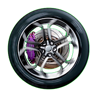

# MundoCoches :earth_africa::oncoming_automobile:
http://mundocoches.byethost22.com

## Cómo configurar VS Code con GitHub
- Una vez abierto Code pulsamos **Ctrl+Shift+P** y escribimos git clone y pulsamos intro. 
- Pegamos la URL del repositorio `https://github.com/jesusdc99/mundocoches/` y volvemos a pulsar intro. 
- Ahora nos pide la carpeta local en la que queremos copiar el repositorio. En esta carpeta nos creará otra con el nombre del repositorio. 
- Ya tendremos los archivos del repositorio descargados. 
- Si hacemos cualquier cambio nos aparecerá un número en el icono del control de versiones con el número de archivos modificados. 
- Si queremos subir un archivo nos vamos a cambios, lo agregamos con el símbolo `+` a la cola de confirmaciones. 
- Para subirlo le damos al símbolo del 'tick' y confirmamos cambios. Se quedarán listos para la subida a la rama mostrada abajo a la izquierda. 
- Para cambiar la rama hacemos clic en el nombre de la rama actual y seleccionamos una de la lista. 
- Para subirlo le damos al símbolo del 'tick' y confirmamos cambios. Se quedarán listos para la subida. 
- Finalmente para subirlos nos vamos a la barra inferior azul que indicará que hay un archivo listo para subirse. Le hacemos clic y listo.

   

https://github.com/jesusdc99/mundocoches/

https://bitbucket.org/jesusdc99/mundocoches/

https://startbootstrap.com/template-overviews/grayscale/

#### Otros enlaces:

https://startbootstrap.com/template-overviews/grayscale/ 

https://html5up.net/ 

http://www.paletton.com/palette.php?uid=13N0u0kl-4Fb-8Rh86Cqr2Zxr1p 

paleta2: http://www.paletton.com/palette.php?uid=13N0u0klz9Bdghdhjcep%2B6Cvx3C 

http://www.monolinea.com/projects/styleguide/ 

https://stackoverflow.com/a/2790919/10387022 

https://bootsnipp.com/snippets/QoZeX 

https://www.seleniumhq.org/ Para realizar pruebas en las distintas páginas del proyecto 

https://github.com/sampotts/plyr 

Términos legales extraídos de https://www.roberthalf.cl/terminos-y-condiciones-de-uso-de-sitio-web y https://www.coches.net/condiciones-de-uso/ 

Posibles formularios de Login y Registro: https://startbootstrap.com/snippets/login/ https://startbootstrap.com/snippets/registration-page/ 

Sitemaps: https://neilpatel.com/es/blog/mapa-de-sitio-xml/ 

Editor de texto WYSIWYG: https://summernote.org/deep-dive/#custom-toolbar-popover 

Valoracion de contenidos: https://codepen.io/depy/pen/vEWWdw 

Estilo comentarios: https://bootsnipp.com/snippets/7Nj38 

  

